Capstone - Final
================
Sergey Mouzykin
December 23, 2017

### Introduction

The great beer shortage has driven people to madness. No. That is obviously not true. On the contrary, the abundance of beer variety has left us with little imagination as to what the next micro brew will be found on the shelves of your local beer distributor. Perhaps there is hope in narrowing down your next selection before the next meal by using some type of recommendation system based on previous reviews. The decision for your next beer experience doesn't have to be a tedious one. Technology exists to make our lives easier and this surely applies in aiding decision making in regards to the next purchase of a perfect brew.

Sifting through a diverse selection of beers can be quite overwhelming. However, there is a methodical approach that we can take in order to solve this problem. Instinctively, we can come to realize that there is some type of pattern in our decision making, whether it is selecting your next meal or a beer to go along with it. Through experience of taking in massive amounts of data, our minds have learned how to recognize everyday objects and separate (cluster) them into similar groups. This same technique can be applied specifically for aiding us in selecting a beer that will match anyone's personal preference. In particular, we can use an unsupervised learning technique to classify similarities and cluster them into groups.

### Client

The client can be an application developer or a website/blog comprised of beer enthusiasts who are looking for a way to recommend beer based on previous reviews in order to invite people to discover new brews from around the world without bias. A well built recommendation system can be a powerful tool which can drive traffic to the client's website or application.

Another possible client can a brewery or distributor. A brewery will most certainly want to know which beers are in high demand so they could optimize their production to focus on demand in order to maximize their profit and increase efficiency of production. The distributor also needs to know which beers are in high demand in order to maintain optimal inventory and sales by communicating their needs to the brewer.

### Beer Reviews Data Set

The data set is a collection of about 1.5 million beer reviews from a period of about 10 years up to 2011. Reviewers were tasked with rating a beer's five aspects such as appearance, aroma, palate, taste and overall impression based on a (1-5) scale. This data set was acquired from data.world [link](https://data.world/socialmediadata/beeradvocate).

### Data Set Preview

| Variable           | Description                           |
|--------------------|---------------------------------------|
| review time        | Number of times the beer was reviewed |
| review overall     | Overall rating of the beer            |
| review aroma       | Aroma rating                          |
| review appearance  | Appearance rating                     |
| review profilename | Reviewer's profile name               |
| review palate      | Palate rating                         |
| review taste       | Taste rating                          |
| brewery name       | Name of the brewery                   |
| brewery ID         | Brewery's identification number       |
| beer style         | Style of the beer                     |
| beer name          | Name of the beer                      |
| beer ABV           | Alcohol content of beer               |
| beer ID            | Identification number of beer         |

### Approach

To begin with, the goal is to focus on a select number of questions to answer in order to create an appropriate recommendation system. These questions will be based on the perspective of the customers and will encompass personal preferences.

1.  Find the overall rating for each beer style and the most popular beer style.

<!-- -->

1.  Which breweries produce the highest rated beers?

<!-- -->

1.  How does each aspect, including alcohol content and beer style, affect the overall rating?

<!-- -->

1.  Create groups for alcohol level (low, medium, high)

<!-- -->

1.  Recommend five beers based on preferred aspects and style (Ex.: Hefeweizen, taste, aroma, ABV).

In order answer these questions, the following techniques will be applied, summary statistics, bar charts, and histograms. Machine learning application will be necessary for providing a recommendation. In general, a variety of clustering methods will be applied to find similarities between various beers and their characteristics.

Things to consider: - Outliers. Some beers may have a low amount of reviews which may skew results adversely and therefore should be discounted. The cutoff needs to be determined. - Missing values. Why are they missing? Can they teach us anything? Will they have a great impact on the overall ratings?

### Data Wrangling Overview

This raw data will be cleaned and wrangled into a form which then can be analyzed. The following will be performed:

-   Column names will be renamed to be short, simple and descriptive
-   All columns with characters will be changed to lower case. This includes brewery name, beer name, beer style, and profile name
-   Any missing values found will be replaced accordingly
-   The amount of beer styles will be reduced from 104 to a more manageable size

Lower Case - Change all columns with characters to lower case. This includes four columns, brewery name, beer name, profile name, and beer style.

Rename Columns

-   Some columns need to be renamed in order to be more concise. The changes are summarized in the table below.

| Old Name            | New Name      |
|---------------------|---------------|
| review\_overall     | overall       |
| review\_aroma       | aroma         |
| review\_appearance  | appearance    |
| review\_palate      | palate        |
| review\_taste       | taste         |
| review\_profilename | profile\_name |
| brewery\_name       | *no change*   |
| brewery\_id         | *no change*   |
| beer\_style         | *no change*   |
| beer\_name          | *no change*   |
| beer\_abv           | *no change*   |
| beer\_id            | *no change*   |
| review\_time        | *no change*   |

### Missing Values

Approach:

1.  Create a function for finding missing values
2.  Iterate this function over every column
3.  Create a matrix of missing values for easier visualization

<!-- -->

    ##                beer id brewery name brewery id beer ABV profile name taste
    ## missing values 0       15           0          67785    348          0    
    ##                palate beer style appearance aroma overall review time
    ## missing values 0      0          0          0     0       0          
    ##                beer name
    ## missing values 0

Missing values are found in the following columns:

| Column       | Amount of missing values |
|--------------|--------------------------|
| brewery name | 15                       |
| beer ABV     | 67,785                   |
| profile name | 348                      |

The alcohol content is not always written on the container and relatively low ABV is not required to be printed on containers. This may explain the large amount of missing values in the *beer\_abv* column.

### Missing Values: beer ABV (alcohol by volume)

To deal with these missing values, the mean of the *beer\_abv* will be computed and used to replace the missing values. After replacing the missing values, the column will be checked again for any missing values in order to confirm the result.

``` r
mean_abv = mean(beer_reviews$beer_abv, na.rm = TRUE) # = 7.04
median_abv = median(beer_reviews$beer_abv, na.rm = TRUE) # 6.6

# replace the missing values in ABV with the mean
beer_reviews = 
  beer_reviews %>%
  replace_na(list(beer_abv = mean_abv))
# check for missing values again
find_NA(beer_reviews$beer_abv)
```

    ## # A tibble: 1 x 1
    ##   missing_values
    ##            <int>
    ## 1              0

### Missing Values: Brewery Name

At the moment, we can't make any accurate guesses as to what the names are of the breweries. Therefore, their missing values will be replaced with the string '*unknown*'. After replacing the missing values, the column will be checked again for any missing values in order to confirm the result.

``` r
# view the matrix with missing values
missing_matrix
```

    ##                beer id brewery name brewery id beer ABV profile name taste
    ## missing values 0       15           0          67785    348          0    
    ##                palate beer style appearance aroma overall review time
    ## missing values 0      0          0          0     0       0          
    ##                beer name
    ## missing values 0

``` r
# replace the missing names with 'unknown'
beer_reviews = 
  beer_reviews %>%
  replace_na(list(brewery_name = 'unknown'))
# check for missing values again
find_NA(beer_reviews$brewery_name)
```

    ## # A tibble: 1 x 1
    ##   missing_values
    ##            <int>
    ## 1              0

### Missing Values: Profile Name

Profile names will be replaced with the string '*unknown*' since we can't make any accurate guesses of somebody's name in this instance.

``` r
# view the matrix with missing values
missing_matrix
```

    ##                beer id brewery name brewery id beer ABV profile name taste
    ## missing values 0       15           0          67785    348          0    
    ##                palate beer style appearance aroma overall review time
    ## missing values 0      0          0          0     0       0          
    ##                beer name
    ## missing values 0

``` r
# glance over the missing values
beer_reviews %>%
  select(profile_name) %>%
  filter(is.na(profile_name))
```

    ## # A tibble: 348 x 1
    ##    profile_name
    ##           <chr>
    ##  1         <NA>
    ##  2         <NA>
    ##  3         <NA>
    ##  4         <NA>
    ##  5         <NA>
    ##  6         <NA>
    ##  7         <NA>
    ##  8         <NA>
    ##  9         <NA>
    ## 10         <NA>
    ## # ... with 338 more rows

``` r
# replace the missing profile names with 'Unknown'
beer_reviews = 
  beer_reviews %>%
  replace_na(list(profile_name = 'unknown'))

# check for missing values again
find_NA(beer_reviews$profile_name)
```

    ## # A tibble: 1 x 1
    ##   missing_values
    ##            <int>
    ## 1              0

### Beer Styles

Currently, there are 104 unique beer styles included in this data set. However, some of these styles are highly specific due to their brewing process, ingredient ratios, yeast type, or a combination of other factors; but they can be grouped together since they are a variation of an ale or a lager. The goal is to classify them into more general terms, but without over simplifying, in order to produce plots that are easy to read and translate. A new column will be created to represent these styles. The approach will involve doing some research on the current beer styles included and deciding how to categorize them to yield a reduced list. The *gsub* function will be used to iterate over beer styles and categorize them accordingly.

New Beer-Style column will consist of the following styles:

| Beer Style |        |        |            |          |
|------------|--------|--------|------------|----------|
| ale        | lager  | stout  | lambic     | spiced   |
| pilsner    | porter | smoked | barleywine | ipa      |
| wheat      | bock   | bitter | rye        | trappist |

A new column for beer styles is created using the mutate() function.

``` r
# create new column with the new styles using mutate()
beer_reviews = 
  beer_reviews %>%
  mutate(general_beer_style = style_list_mod)

glimpse(beer_reviews)
```

    ## Observations: 1,586,614
    ## Variables: 14
    ## $ brewery_name       <chr> "vecchio birraio", "vecchio birraio", "vecc...
    ## $ beer_name          <chr> "sausa weizen", "red moon", "black horse bl...
    ## $ profile_name       <chr> "stcules", "stcules", "stcules", "stcules",...
    ## $ beer_style         <chr> "hefeweizen", "english strong ale", "foreig...
    ## $ taste              <dbl> 1.5, 3.0, 3.0, 3.0, 4.5, 3.5, 4.0, 3.5, 4.0...
    ## $ palate             <dbl> 1.5, 3.0, 3.0, 2.5, 4.0, 3.0, 4.0, 2.0, 3.5...
    ## $ appearance         <dbl> 2.5, 3.0, 3.0, 3.5, 4.0, 3.5, 3.5, 3.5, 3.5...
    ## $ aroma              <dbl> 2.0, 2.5, 2.5, 3.0, 4.5, 3.5, 3.5, 2.5, 3.0...
    ## $ overall            <dbl> 1.5, 3.0, 3.0, 3.0, 4.0, 3.0, 3.5, 3.0, 4.0...
    ## $ brewery_id         <int> 10325, 10325, 10325, 10325, 1075, 1075, 107...
    ## $ beer_id            <int> 47986, 48213, 48215, 47969, 64883, 52159, 5...
    ## $ review_time        <int> 1234817823, 1235915097, 1235916604, 1234725...
    ## $ beer_abv           <dbl> 5.0, 6.2, 6.5, 5.0, 7.7, 4.7, 4.7, 4.7, 4.7...
    ## $ general_beer_style <chr> "wheat", "ale", "stout", "pilsner", "ipa", ...

``` r
# summarize the new beer styles by calling distinct()
beer_reviews %>%
  group_by(general_beer_style) %>%
  summarise(style_count = n()) %>%
  arrange(desc(style_count))
```

    ## # A tibble: 24 x 2
    ##    general_beer_style style_count
    ##                 <chr>       <int>
    ##  1                ale      577361
    ##  2                ipa      216034
    ##  3              stout      182268
    ##  4              lager      132481
    ##  5              wheat       80947
    ##  6             porter       73249
    ##  7           trappist       68397
    ##  8               bock       46501
    ##  9         barleywine       40459
    ## 10            pilsner       40330
    ## # ... with 14 more rows

### Plot: Beer ABV

Plotting the beer's ABV as a histogram will reveal it's distribution and help us spot any outliers that may be present before diving into deeper analysis.


This plot shows us that the ABV is actually a right-skewed distribution due to some beers having a a very high alcohol by volume content. The minimum and maximum of ABV content are 0.01% and 57.7%, respectively. The mean lies at 7.04, the median at 6.6, and the standard deviation is 2.27. We can also infer that the distribution is right-skewed due to the median being lower than the mean as the outliers have a greater effect on the mean than the median. Although the values range from 0.01 to 57.7, in theory, about 95% of these values should lie within two standard deviations from the mean.

| Stat               | Value |
|--------------------|-------|
| Standard Deviation | 2.27  |
| Variance           | 5.16  |
| Mean               | 7.04  |
| Median             | 6.6   |
| Max                | 57.7  |
| Min                | 0.01  |

``` r
# find max and min for beer ABV
# replace the missing values before finding MAX and MIN
max(beer_reviews$beer_abv) # 57.7 % 
```

    ## [1] 57.7

``` r
min(beer_reviews$beer_abv) # 0.01 % 
```

    ## [1] 0.01

### Interval: Beer ABV

In order to better visualize the alcohol level content, the ABV can be distributed into five factored levels using the calculated mean and standard deviation. These five levels will be labeled as, '*low*', '*below normal*', '*normal*', *'above normal*', and '*high*'. The computed standard deviation will be used to create the breaks for the labels.

    ## [1] 2.272372

    ## [1] 5.163673

    ## [1] 1586614

    ## interval_abv
    ##          low below normal       normal above normal         high 
    ##         1630       140735      1193157       200598        50494

Sum the amounts within two standard deviations and divide by total amount of rows. This will contain about 95% of all the data points in the beer's abv column.

    ## [1] 96.71476

``` r
# NEW COLUMN: beer_abv_factor
beer_reviews = 
  beer_reviews %>%
  mutate(beer_abv_factor = interval_abv)

glimpse(beer_reviews)
```

    ## Observations: 1,586,614
    ## Variables: 15
    ## $ brewery_name       <chr> "vecchio birraio", "vecchio birraio", "vecc...
    ## $ beer_name          <chr> "sausa weizen", "red moon", "black horse bl...
    ## $ profile_name       <chr> "stcules", "stcules", "stcules", "stcules",...
    ## $ beer_style         <chr> "hefeweizen", "english strong ale", "foreig...
    ## $ taste              <dbl> 1.5, 3.0, 3.0, 3.0, 4.5, 3.5, 4.0, 3.5, 4.0...
    ## $ palate             <dbl> 1.5, 3.0, 3.0, 2.5, 4.0, 3.0, 4.0, 2.0, 3.5...
    ## $ appearance         <dbl> 2.5, 3.0, 3.0, 3.5, 4.0, 3.5, 3.5, 3.5, 3.5...
    ## $ aroma              <dbl> 2.0, 2.5, 2.5, 3.0, 4.5, 3.5, 3.5, 2.5, 3.0...
    ## $ overall            <dbl> 1.5, 3.0, 3.0, 3.0, 4.0, 3.0, 3.5, 3.0, 4.0...
    ## $ brewery_id         <int> 10325, 10325, 10325, 10325, 1075, 1075, 107...
    ## $ beer_id            <int> 47986, 48213, 48215, 47969, 64883, 52159, 5...
    ## $ review_time        <int> 1234817823, 1235915097, 1235916604, 1234725...
    ## $ beer_abv           <dbl> 5.0, 6.2, 6.5, 5.0, 7.7, 4.7, 4.7, 4.7, 4.7...
    ## $ general_beer_style <chr> "wheat", "ale", "stout", "pilsner", "ipa", ...
    ## $ beer_abv_factor    <fctr> normal, normal, normal, normal, normal, be...

### Write the cleaned data to a new file

The clean file is now ready to be written.

``` r
beer_reviews_clean = beer_reviews
glimpse(beer_reviews_clean)
```

    ## Observations: 1,586,614
    ## Variables: 15
    ## $ brewery_name       <chr> "vecchio birraio", "vecchio birraio", "vecc...
    ## $ beer_name          <chr> "sausa weizen", "red moon", "black horse bl...
    ## $ profile_name       <chr> "stcules", "stcules", "stcules", "stcules",...
    ## $ beer_style         <chr> "hefeweizen", "english strong ale", "foreig...
    ## $ taste              <dbl> 1.5, 3.0, 3.0, 3.0, 4.5, 3.5, 4.0, 3.5, 4.0...
    ## $ palate             <dbl> 1.5, 3.0, 3.0, 2.5, 4.0, 3.0, 4.0, 2.0, 3.5...
    ## $ appearance         <dbl> 2.5, 3.0, 3.0, 3.5, 4.0, 3.5, 3.5, 3.5, 3.5...
    ## $ aroma              <dbl> 2.0, 2.5, 2.5, 3.0, 4.5, 3.5, 3.5, 2.5, 3.0...
    ## $ overall            <dbl> 1.5, 3.0, 3.0, 3.0, 4.0, 3.0, 3.5, 3.0, 4.0...
    ## $ brewery_id         <int> 10325, 10325, 10325, 10325, 1075, 1075, 107...
    ## $ beer_id            <int> 47986, 48213, 48215, 47969, 64883, 52159, 5...
    ## $ review_time        <int> 1234817823, 1235915097, 1235916604, 1234725...
    ## $ beer_abv           <dbl> 5.0, 6.2, 6.5, 5.0, 7.7, 4.7, 4.7, 4.7, 4.7...
    ## $ general_beer_style <chr> "wheat", "ale", "stout", "pilsner", "ipa", ...
    ## $ beer_abv_factor    <fctr> normal, normal, normal, normal, normal, be...

``` r
# write the clean file 
write_csv(beer_reviews_clean, 'beer_reviews_clean.csv')
```

### Summary Statistics

This will be a good and simple starting point for finding more complex answers later on. Summary statistics will give us a glimpse into the characteristics of this data set and will guide us toward the next steps.

### Beer Name

Here we will summarize the standard deviation, variance, mean, median, max, and min for every beer name. Also, it will be useful to summarize each rated characteristic such as the *overall*, *taste*, *appearace*, *aroma*, and *palate.*

    ##                    Overall Rating Summary
    ## standard deviation 0.7206219             
    ## variance           0.5192959             
    ## mean               3.815581              
    ## median             4                     
    ## max                5                     
    ## min                0

    ##                    Taste Rating Summary
    ## standard deviation 0.7319696           
    ## variance           0.5357795           
    ## mean               3.79286             
    ## median             4                   
    ## max                5                   
    ## min                1

    ##                    Aroma Rating Summary
    ## standard deviation 0.6976167           
    ## variance           0.4866691           
    ## mean               3.735636            
    ## median             4                   
    ## max                5                   
    ## min                1

    ##                    Appearance Rating Summary
    ## standard deviation 0.6160928                
    ## variance           0.3795703                
    ## mean               3.841642                 
    ## median             4                        
    ## max                5                        
    ## min                0

    ##                    Palate Rating Summary
    ## standard deviation 0.6822184            
    ## variance           0.4654219            
    ## mean               3.743701             
    ## median             4                    
    ## max                5                    
    ## min                1

The min and max for two columns, overall and appearance, are 0 and 5 respectively. It's worth taking a closer look at those ratings since the other aspects range from 1 to 5.

Looking at the mean and standard deviation (SD) of overall stat summary column where the overall rating is given a zero, it is interesting to find that in some of the more extreme scenarios, the ratings between different aspects vary greatly. In particular, for the beer, *Latter Days Stout*, we can find that a rating of zero for the overall was given out while at the same time its aroma was rated a four. It seems contradictory to rate the overall as a zero while enjoying at least one aspect of the beer, in particular, its aroma.

    ## # A tibble: 7 x 8
    ## # Groups:   beer_name, overall, taste, aroma, appearance [7]
    ##                 beer_name overall taste aroma appearance palate
    ##                     <chr>   <dbl> <dbl> <dbl>      <dbl>  <dbl>
    ## 1       latter days stout       0   2.0     4          0    2.0
    ## 2                pub pils       0   2.0     2          0    3.0
    ## 3      red rock amber ale       0   3.5     3          0    2.5
    ## 4 red rock bavarian weiss       0   2.0     2          0    2.5
    ## 5  red rock dunkel weizen       0   2.0     2          0    2.5
    ## 6        red rock pilsner       0   1.5     2          0    3.0
    ## 7           utah pale ale       0   2.0     3          0    2.0
    ## # ... with 2 more variables: beer_name_count <int>, overall_sd <dbl>

    ## # A tibble: 38,364 x 8
    ## # Groups:   beer_name [37,852]
    ##                                   beer_name general_beer_style
    ##                                       <chr>              <chr>
    ##  1                 '99 wee heavy scotch ale                ale
    ##  2              't hommelhof cuvée spéciale                ale
    ##  3                                "\"100\""                ale
    ##  4      "\"12\"  belgian golden strong ale"                ale
    ##  5                          "\"33\" export"              lager
    ##  6              "\"4\" horse oatmeal stout"              stout
    ##  7                 "\"76\" anniversary ale"                ale
    ##  8                      "\"alt\"ered state"                ale
    ##  9            "\"naughty scot\" scotch ale"                ale
    ## 10         "\"old school\" craft cream ale"                ale
    ## 11                "\"the camp\" barleywine"         barleywine
    ## 12                                #1 saison                ale
    ## 13                      #1073 prairie stout              stout
    ## 14                             ¿por que no?                ale
    ## 15                          10 bbl pale ale                ale
    ## 16                                   1000.0                ale
    ## 17                     10th anniversary ale              wheat
    ## 18 10th anniversary oak aged rye barleywine         barleywine
    ## 19                             111 pilsener            pilsner
    ## 20                      1133 biere d'abbaye                ale
    ## # ... with 3.834e+04 more rows, and 6 more variables:
    ## #   beer_name_count <int>, overall_sd <dbl>, taste_sd <dbl>,
    ## #   aroma_sd <dbl>, appearance_sd <dbl>, palate_sd <dbl>

    ##                    Beer Review Count
    ## standard deviation 146.3773         
    ## variance           21426.3          
    ## mean               40.85022         
    ## median             5                
    ## max                3290             
    ## min                2

### Plot: Standard Deviation Distribution

These plots illustrate the distribution of the standard deviations.

In support to the histogram, we can also calculate the mean, median, standard deviation, maximum rating, and minimum rating. Essentially, the deviation can tell us how divisive people are among the ratings. Generally, it appears that people will agree on a rating value to within about 3/4 of a point. However, the deviation will vary depending on the beer.

``` r
# PLOT
# overall_sd histogram
ggplot(beer_reviews_SD, aes(x = overall_sd)) + 
  geom_histogram(binwidth = 0.1, fill = '#3182BD', col = 'black') + 
  scale_x_continuous('Overall Deviation', breaks = seq(0, 3.0, by = 0.2)) +
  theme_blue
```

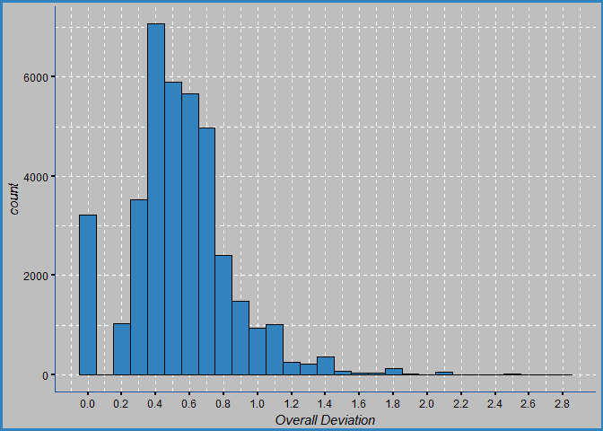

``` r
stats_function_2(beer_reviews_SD$overall_sd, 'Overall SD Summary')
```

    ##                    Overall SD Summary
    ## standard deviation 0.2995806         
    ## variance           0.08974856        
    ## mean               0.5390207         
    ## median             0.5188745         
    ## max                2.828427          
    ## min                0

``` r
ggplot(beer_reviews_SD, aes(x = taste_sd)) + 
  geom_histogram(binwidth = 0.1, fill = '#3182BD', col = 'black') + 
  scale_x_continuous('Taste Deviation', breaks = seq(0, 3.0, by = 0.2)) +
  theme_blue
```

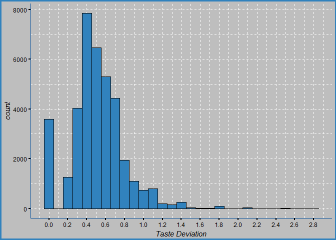

``` r
stats_function_2(beer_reviews_SD$taste_sd, 'Taste SD Summary')
```

    ##                    Taste SD Summary
    ## standard deviation 0.2844422       
    ## variance           0.08090736      
    ## mean               0.5029366       
    ## median             0.4936502       
    ## max                2.828427        
    ## min                0

``` r
ggplot(beer_reviews_SD, aes(x = aroma_sd)) + 
  geom_histogram(binwidth = 0.1, fill = '#3182BD', col = 'black') + 
  scale_x_continuous('Aroma Deviation', breaks = seq(0, 3.0, by = 0.2)) +
  theme_blue
```

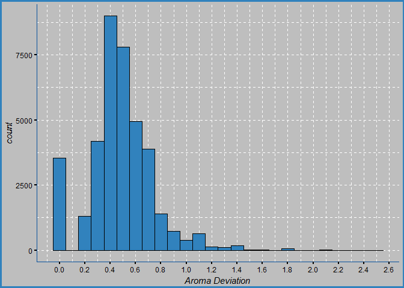

``` r
stats_function_2(beer_reviews_SD$aroma_sd, 'Aroma SD Summary')
```

    ##                    Aroma SD Summary
    ## standard deviation 0.2541058       
    ## variance           0.06456977      
    ## mean               0.4724818       
    ## median             0.4714045       
    ## max                2.474874        
    ## min                0

``` r
ggplot(beer_reviews_SD, aes(x = appearance_sd)) + 
  geom_histogram(binwidth = 0.1, fill = '#3182BD', col = 'black') + 
  scale_x_continuous('Appearance Deviation', breaks = seq(0, 3.0, by = 0.2)) +
  theme_blue
```

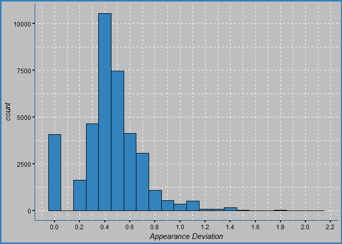

``` r
stats_function_2(beer_reviews_SD$appearance_sd, 'Appearance SD Summary')
```

    ##                    Appearance SD Summary
    ## standard deviation 0.2418059            
    ## variance           0.05847009           
    ## mean               0.4395605            
    ## median             0.4291975            
    ## max                2.12132              
    ## min                0

``` r
ggplot(beer_reviews_SD, aes(x = palate_sd)) + 
  geom_histogram(binwidth = 0.1, fill = '#3182BD', col = 'black') + 
  scale_x_continuous('Palate Deviation', breaks = seq(0, 3.0, by = 0.2)) +
  theme_blue 
```

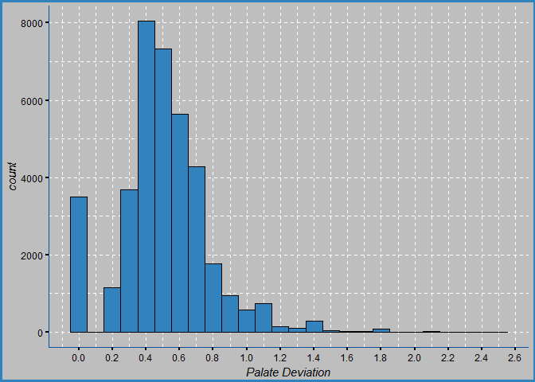

``` r
stats_function_2(beer_reviews_SD$palate_sd, 'Palate SD Summary')
```

    ##                    Palate SD Summary
    ## standard deviation 0.2693696        
    ## variance           0.07255996       
    ## mean               0.4966859        
    ## median             0.4929625        
    ## max                2.474874         
    ## min                0

Additionally, a filter can be created to find beers with the smallest deviation. This will return a list of beers which reviewers are more likely to agree upon with their ratings.

``` r
# NOTE: 
# with only 1 or 2 reviews, disagreements vary greatly among the 5 observations
# 1. lower deviation implies agreement between different reviews
# 2. higher deviation implies disagreement between reviewers

# GRAPH NOTE:
# The outliers contained in the graph are due to low amount of reviews and the disagreements between reviewers

# FIND the least amount of disagreements by filtering the SD for each observation. Smaller deviation = less disagreement
# filter(sd between(0, 0.25), name_count >=5)
beer_reviews_sd_filter = 
  beer_reviews %>%
  group_by(beer_name, general_beer_style) %>%
  summarise(beer_name_count = n(), 
            overall_sd    = sd(overall), 
            taste_sd      = sd(taste), 
            aroma_sd      = sd(aroma), 
            appearance_sd = sd(appearance), 
            palate_sd     = sd(palate)) %>%
  filter(beer_name_count >= 5, 
         between(overall_sd, 0, 0.30), 
         between(taste_sd, 0, 0.30), 
         between(aroma_sd, 0, 0.30), 
         between(appearance_sd, 0, 0.30), 
         between(palate_sd, 0, 0.30)) %>%
  arrange(overall_sd, taste_sd, aroma_sd, appearance_sd, palate_sd) %>%
  print(n = 20)
```

    ## # A tibble: 75 x 8
    ## # Groups:   beer_name [75]
    ##                                                   beer_name
    ##                                                       <chr>
    ##  1                                  founders dirty darkness
    ##  2                                kelso industrial pale ale
    ##  3                                                red scare
    ##  4                                  starobrno cerne (black)
    ##  5                                                super wit
    ##  6                                    oak-aged cherry stout
    ##  7                                                   spooky
    ##  8                                                 rye not?
    ##  9                                     limited edition 2004
    ## 10     st. denis pilzenn imperialni (deni pilsner imperial)
    ## 11                              old bad cat barleywine 2008
    ## 12                 andechser dunkel naturtrüb jubiläumsbier
    ## 13                                                pale tail
    ## 14                                        sandy paws (2010)
    ## 15 pilot series passionfruit and dragonfruit berliner weiss
    ## 16                               chaos chaos imperial stout
    ## 17                                                      sfo
    ## 18                                             live oak ipa
    ## 19                     maduro oatmeal brown ale - blueberry
    ## 20                                       hotter than helles
    ## # ... with 55 more rows, and 7 more variables: general_beer_style <chr>,
    ## #   beer_name_count <int>, overall_sd <dbl>, taste_sd <dbl>,
    ## #   aroma_sd <dbl>, appearance_sd <dbl>, palate_sd <dbl>

### General Beer Style

    ## # A tibble: 24 x 8
    ##                 general_beer_style style_count overall_mean overall_sd
    ##                              <chr>       <int>        <dbl>      <dbl>
    ##  1                low alcohol beer        1201     2.578268  1.0073243
    ##  2            american malt liquor        3925     2.678854  1.0338246
    ##  3                        happoshu         241     2.914938  0.9863785
    ##  4          fruit / vegetable beer       33861     3.415124  0.8917166
    ##  5                   spiced/herbed       13663     3.424907  0.8712269
    ##  6                           lager      132481     3.438693  0.9056884
    ##  7                     black & tan        2358     3.486853  0.7200659
    ##  8 bière de champagne / bière brut        1046     3.648184  0.8661809
    ##  9                           sahti        1061     3.700283  0.7065662
    ## 10                         pilsner       40330     3.768634  0.7304550
    ## 11                          smoked        6948     3.778929  0.6740619
    ## 12                             ale      577361     3.795629  0.6902948
    ## 13                            bock       46501     3.813047  0.6678802
    ## 14                       wheatwine        3714     3.815563  0.6502937
    ## 15                          bitter       25999     3.825743  0.6536035
    ## 16                           wheat       80947     3.868840  0.6865366
    ## 17                      barleywine       40459     3.881089  0.6392141
    ## 18              flanders oud bruin        4995     3.902503  0.6840799
    ## 19                          porter       73249     3.908558  0.6347968
    ## 20                          lambic       18682     3.954502  0.7081593
    ## 21                        trappist       68397     3.958068  0.6326675
    ## 22                           stout      182268     3.960232  0.6612623
    ## 23                             rye       10893     3.963233  0.6122244
    ## 24                             ipa      216034     3.977897  0.6193515
    ## # ... with 4 more variables: taste_sd <dbl>, aroma_sd <dbl>,
    ## #   appearance_sd <dbl>, palate_sd <dbl>

    ##                    Style Count
    ## standard deviation 123448.7   
    ## variance           15239576394
    ## mean               66108.92   
    ## median             22340.5    
    ## max                577361     
    ## min                241

    ##                    Overall SD
    ## standard deviation 0.1329949 
    ## variance           0.01768764
    ## mean               0.7472439 
    ## median             0.6884157 
    ## max                1.033825  
    ## min                0.6122244

    ##                    Overall Mean
    ## standard deviation 0.399404    
    ## variance           0.1595236   
    ## mean               3.644107    
    ## median             3.804338    
    ## max                3.977897    
    ## min                2.578268

    ##                    Aroma SD   
    ## standard deviation 0.09766952 
    ## variance           0.009539336
    ## mean               0.6561789  
    ## median             0.6188605  
    ## max                0.8507946  
    ## min                0.5366802

    ##                    Taste SD  
    ## standard deviation 0.1132976 
    ## variance           0.01283634
    ## mean               0.717111  
    ## median             0.6716393 
    ## max                0.9552426 
    ## min                0.6070527

    ##                    Appearance SD
    ## standard deviation 0.1131763    
    ## variance           0.01280887   
    ## mean               0.5966167    
    ## median             0.5577862    
    ## max                0.8427827    
    ## min                0.4783073

    ##                    Palate SD 
    ## standard deviation 0.1034379 
    ## variance           0.01069939
    ## mean               0.6709814 
    ## median             0.6295702 
    ## max                0.8835709 
    ## min                0.5470604

Looking at the general beer style, we can find the least disliked beer style by looking at the mean of the overall (shown above). However, the standard deviation (1.00) is quite high in this case which implies disagreement and the ratings can vary by one point. Therefore, we cannot absolutely conclude that the low alcohol beer is rated the worst. Although, we can say that it is one the least appreciated beer styles among a few others.

### Beer Style

We can find the beer styles which are relatively best rated (shown below).

    ## # A tibble: 104 x 8
    ##                             beer_style style_count overall_sd overall_mean
    ##                                  <chr>       <int>      <dbl>        <dbl>
    ##  1                   american wild ale       17794  0.6542419     4.093262
    ##  2                              gueuze        6009  0.6413163     4.086287
    ##  3                    quadrupel (quad)       18086  0.6296276     4.071630
    ##  4                  lambic - unblended        1114  0.6567664     4.048923
    ##  5    american double / imperial stout       50705  0.6664566     4.029820
    ##  6              russian imperial stout       54129  0.6354456     4.023084
    ##  7                          weizenbock        9412  0.5983101     4.007969
    ##  8      american double / imperial ipa       85977  0.6367582     3.998017
    ##  9                    flanders red ale        6664  0.6752854     3.992722
    ## 10                            rye beer       10130  0.5930640     3.981737
    ## 11          keller bier / zwickel bier        2591  0.6257269     3.981088
    ## 12                             eisbock        2663  0.6250778     3.977094
    ## 13                        american ipa      117586  0.6107604     3.965221
    ## 14                                gose         686  0.6221699     3.965015
    ## 15              saison / farmhouse ale       31480  0.6183095     3.962564
    ## 16                         belgian ipa       12471  0.5726129     3.958704
    ## 17                       baltic porter       11572  0.5905583     3.955410
    ## 18                          roggenbier         466  0.5313079     3.948498
    ## 19                       oatmeal stout       18145  0.6314181     3.941692
    ## 20                  american black ale       11446  0.5622348     3.934475
    ## 21                          hefeweizen       27908  0.6767538     3.929626
    ## 22                              dubbel       19983  0.6270035     3.921733
    ## 23                      english porter       11200  0.6361153     3.917946
    ## 24                              tripel       30328  0.6299255     3.914287
    ## 25             belgian strong dark ale       37743  0.6353371     3.913322
    ## 26                  flanders oud bruin        4995  0.6840799     3.902503
    ## 27                  berliner weissbier        3475  0.7678588     3.901151
    ## 28                             old ale       14703  0.6402962     3.899000
    ## 29                 american barleywine       26728  0.6206632     3.896756
    ## 30                     american porter       50477  0.6437006     3.895735
    ## 31             belgian strong pale ale       31490  0.6514504     3.895602
    ## 32                  milk / sweet stout       13166  0.6554527     3.892526
    ## 33                      lambic - fruit       10950  0.7297482     3.892283
    ## 34                      bière de garde        6729  0.6160419     3.880294
    ## 35              foreign / export stout        5972  0.6308640     3.877679
    ## 36              scotch ale / wee heavy       17441  0.6065514     3.874262
    ## 37                 american strong ale       31945  0.6956994     3.873501
    ## 38                          doppelbock       21699  0.6604465     3.872805
    ## 39                 munich helles lager        7870  0.6924057     3.869441
    ## 40                      american stout       24538  0.6710999     3.865311
    ## 41  american double / imperial pilsner        5435  0.6335278     3.858694
    ## 42                  american brown ale       25297  0.6226342     3.857434
    ## 43                        dunkelweizen        7122  0.6448806     3.856782
    ## 44             american pale ale (apa)       63469  0.6604517     3.852306
    ## 45                  english barleywine       13731  0.6728391     3.850594
    ## 46      california common / steam beer        4038  0.6472510     3.847821
    ## 47 extra special / strong bitter (esb)       17212  0.6195223     3.847025
    ## 48               english dark mild ale        2314  0.7312741     3.837511
    ## 49                         schwarzbier        9826  0.6367924     3.835030
    ## 50           dortmunder / export lager        4440  0.7259446     3.833108
    ## # ... with 54 more rows, and 4 more variables: taste_sd <dbl>,
    ## #   aroma_sd <dbl>, appearance_sd <dbl>, palate_sd <dbl>

    ##                    Overall Stats
    ## standard deviation 0.1080415    
    ## variance           0.01167296   
    ## mean               0.7007821    
    ## median             0.6698763    
    ## max                1.12708      
    ## min                0.5313079

    ##                    Overall Mean Stats
    ## standard deviation 0.3019827         
    ## variance           0.09119353        
    ## mean               3.732231          
    ## median             3.821994          
    ## max                4.093262          
    ## min                2.578268

    ##                    Taste Stats
    ## standard deviation 0.09168585 
    ## variance           0.008406294
    ## mean               0.6661918  
    ## median             0.6370729  
    ## max                1.096588   
    ## min                0.4824496

    ##                    Aroma Stats
    ## standard deviation 0.07634401 
    ## variance           0.005828408
    ## mean               0.6078849  
    ## median             0.584121   
    ## max                0.9147802  
    ## min                0.4632211

    ##                    Appearance Stats
    ## standard deviation 0.08295096      
    ## variance           0.006880862     
    ## mean               0.5579751       
    ## median             0.5283527       
    ## max                0.8498464       
    ## min                0.4154222

    ##                    Palate Stats
    ## standard deviation 0.08356234  
    ## variance           0.006982665 
    ## mean               0.6312968   
    ## median             0.6119725   
    ## max                1.009596    
    ## min                0.498748

### Plot: Beer ABV (alcohol by volume)

This plot shows us that the ABV is actually a right-skewed distribution due to some beers having a a very high alcohol by volume content. The minimum and maximum of ABV content are 0.01% and 57.7%, respectively. The mean lies at 7.04, the median at 6.6, and the standard deviation is 2.27. We can also infer that the distribution is right-skewed due to the median being lower than the mean since the mean can easily be affected by outliers. Although the values range from 0.01 to 57.7, in theory, about 95% of these values should lie within two standard deviations from the mean.

``` r
# reduce the amount of data points with the sample_n()
# this will produce the plots much faster than plotting all 1.5 million reviews
beer_reviews_10k = sample_n(beer_reviews, size = 10000)

# PLOT: Beer ABV distribution
ggplot(beer_reviews_10k, aes(x = beer_abv)) + 
  geom_histogram(binwidth = 0.5, position = 'dodge', fill = '#3182BD', col = 'black') + 
  scale_x_continuous('Alcohol by Volume (%)', breaks = seq(0, 60, by = 2)) +
  scale_y_continuous('Beer Count') +
  ggtitle('Beer ABV Distribution') +
  theme_blue
```


``` r
stats_function_2(beer_reviews$beer_abv, 'Beer ABV Summary')
```

    ##                    Beer ABV Summary
    ## standard deviation 2.272372        
    ## variance           5.163673        
    ## mean               7.042387        
    ## median             6.6             
    ## max                57.7            
    ## min                0.01

``` r
# HISTOGRAM
ggplot(beer_reviews_10k, aes(x = as.factor(overall), fill = general_beer_style)) +
  geom_histogram(binwidth = 15, stat = 'count') +
  #scale_x_continuous(limits = c(1,20)) + 
  theme_blue
```


``` r
# ABV factor and beer style
ggplot(beer_reviews_10k, aes(x = beer_abv_factor, fill = general_beer_style)) + 
  geom_histogram(stat = 'count', position = 'dodge') +
  scale_x_discrete('Beer ABV') + 
  theme_blue
```


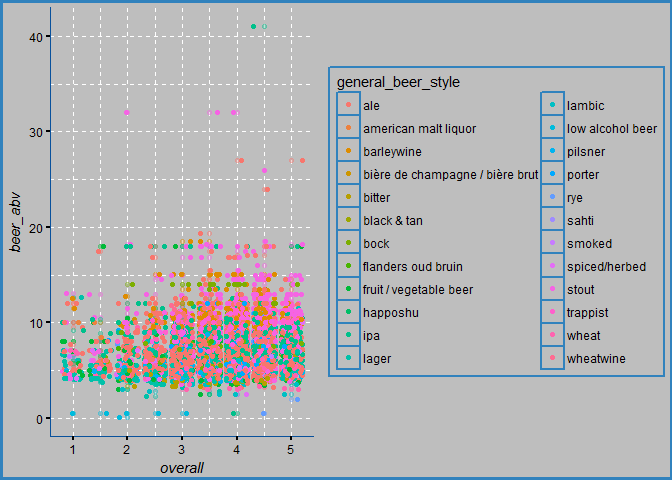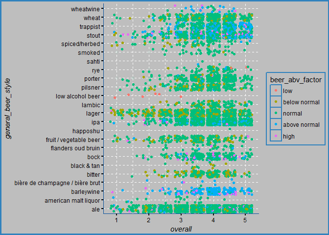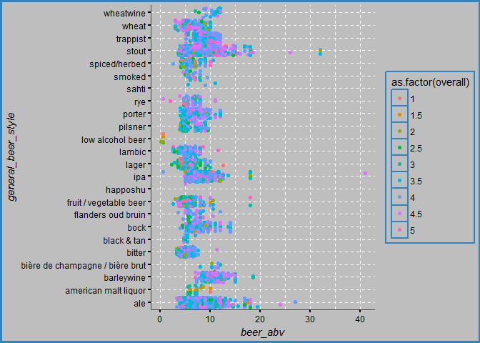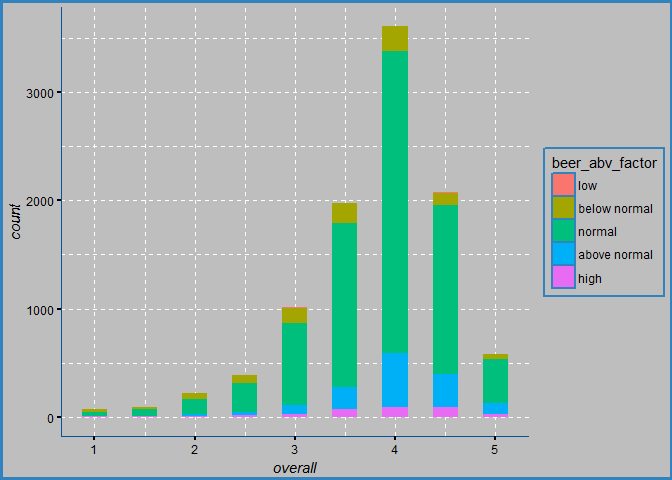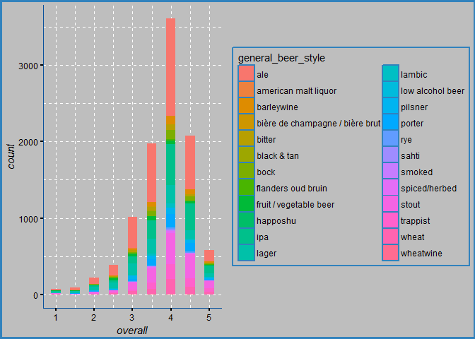

The graphs above helps visualize the overall rating distribution among the beer styles and their respective alcohol content.


    ## 
    ##  Pearson's product-moment correlation
    ## 
    ## data:  beer_reviews$palate and beer_reviews$overall
    ## t = 1241.3, df = 1586600, p-value < 2.2e-16
    ## alternative hypothesis: true correlation is not equal to 0
    ## 95 percent confidence interval:
    ##  0.7011237 0.7027025
    ## sample estimates:
    ##       cor 
    ## 0.7019139


    ## 
    ##  Pearson's product-moment correlation
    ## 
    ## data:  beer_reviews$taste and beer_reviews$overall
    ## t = 1622, df = 1586600, p-value < 2.2e-16
    ## alternative hypothesis: true correlation is not equal to 0
    ## 95 percent confidence interval:
    ##  0.7892296 0.7904003
    ## sample estimates:
    ##       cor 
    ## 0.7898156


    ## 
    ##  Pearson's product-moment correlation
    ## 
    ## data:  beer_reviews$aroma and beer_reviews$overall
    ## t = 985.02, df = 1586600, p-value < 2.2e-16
    ## alternative hypothesis: true correlation is not equal to 0
    ## 95 percent confidence interval:
    ##  0.6150466 0.6169777
    ## sample estimates:
    ##       cor 
    ## 0.6160131


    ## 
    ##  Pearson's product-moment correlation
    ## 
    ## data:  beer_reviews$appearance and beer_reviews$overall
    ## t = 730.6, df = 1586600, p-value < 2.2e-16
    ## alternative hypothesis: true correlation is not equal to 0
    ## 95 percent confidence interval:
    ##  0.5005672 0.5028958
    ## sample estimates:
    ##       cor 
    ## 0.5017324

Plotting overall against other aspects, we can observe a linear correlation emerging. Testing for correlation, we can observe that the strongest positive linear correlation occurs between Taste and Overall ratings with a value of 0.7915. Similarly, a strong positive linear correlation occurs between Palate and Overall with a value of 0.7029.

### Plot: Distribution of Ratings

These plots below help visualize the rating distribution of the five aspects, overall, taste, aroma, appearance, and palate.

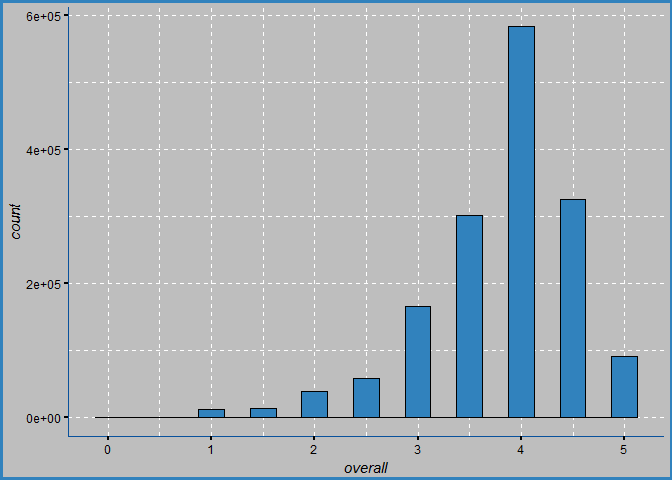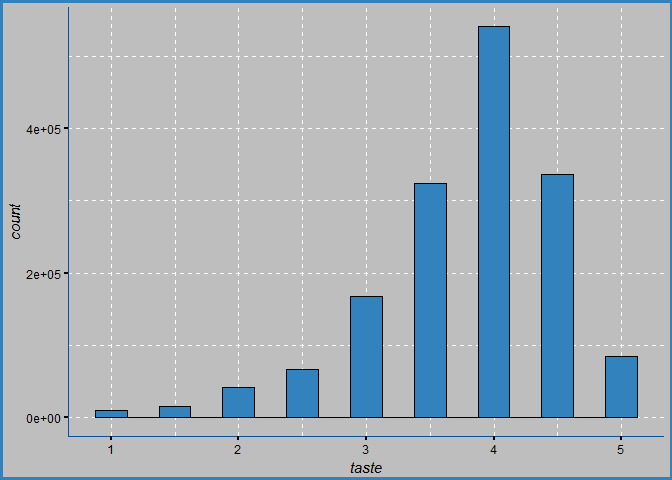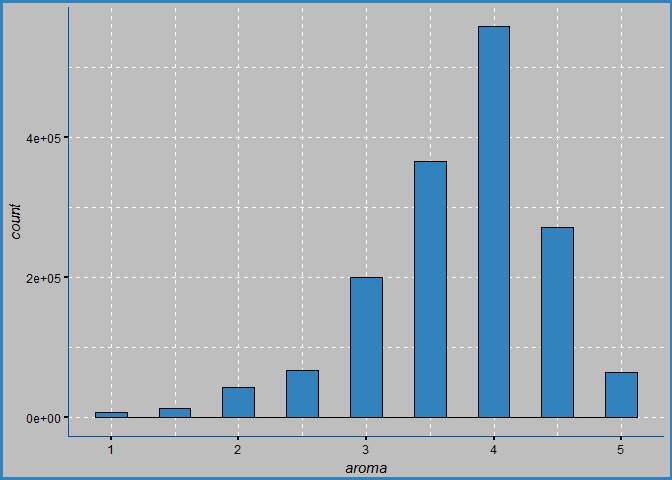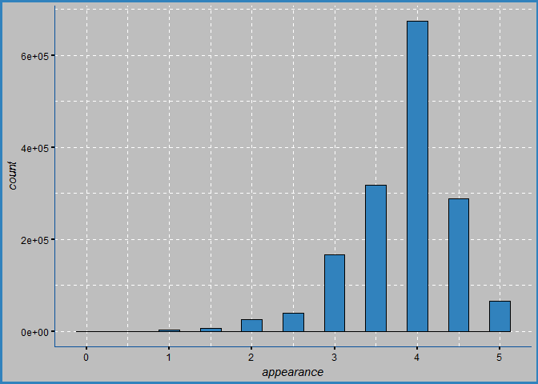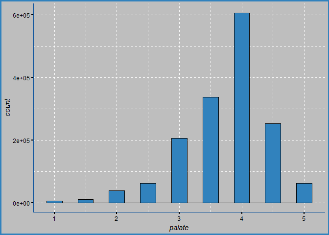

### Brewery Names: Rate the breweries

Let's rate the breweries based on the amount of times a beer from that brewery was reviewed. In total, there are 5,740 distinct breweries included in this data set.

``` r
# distinct amount of breweries
beer_reviews %>%
  select(brewery_name) %>%
  n_distinct()
```

    ## [1] 5740

``` r
# Rating the Breweries
brewery_rating =
  beer_reviews %>%
  group_by(brewery_name) %>%
  summarise(review_count = n(),
            overall_mean = mean(overall),
            overall_sd   = sd(overall)) %>%
  arrange(desc(overall_mean)) %>%
  filter(review_count >= 2) %>%
  print(n = 20)
```

    ## # A tibble: 5,068 x 4
    ##                                                  brewery_name review_count
    ##                                                         <chr>        <int>
    ##  1                                     edsten brewing company            2
    ##  2                            hosokawa sake brewing co., ltd.            2
    ##  3                                    restaurant flieger bräu            2
    ##  4                                      barum brewery limited            2
    ##  5                                   brimstage brewing co ltd            2
    ##  6                                helios distillery co., ltd.            2
    ##  7                                        scone bierbrouwerij            2
    ##  8                                von scheidt brewing company            2
    ##  9                                            sherlock's home            5
    ## 10                                           cheriton brewery            3
    ## 11                                    brauerei zehendner gmbh           28
    ## 12                                   brass monkey brewing co.           10
    ## 13                                              the alchemist          527
    ## 14 brouwerij westvleteren (sint-sixtusabdij van westvleteren)         2378
    ## 15                          augustiner bräu kloster mülln ohg           13
    ## 16                              u fleku pivovaru a restauraci           30
    ## 17                    peg's cantina & brewpub / cycle brewing           79
    ## 18                                        4 hands brewing co.            4
    ## 19                                         amber ales limited            2
    ## 20                                   bad bear brewing company            2
    ## # ... with 5,048 more rows, and 2 more variables: overall_mean <dbl>,
    ## #   overall_sd <dbl>

``` r
stats_function_2(brewery_rating$overall_mean, 'Overall Mean stats')
```

    ##                    Overall Mean stats
    ## standard deviation 0.4845017         
    ## variance           0.2347419         
    ## mean               3.547968          
    ## median             3.642857          
    ## max                5                 
    ## min                1

``` r
stats_function_2(brewery_rating$review_count, 'brewery review stats')
```

    ##                    brewery review stats
    ## standard deviation 1593.546            
    ## variance           2539388             
    ## mean               312.9325            
    ## median             20                  
    ## max                39444               
    ## min                2

``` r
# the median for reviewed amount is 20, so we can use filter() to narrow the search by looking at breweries with at least 20 ratings
  
# Looking at breweries with at least 20 ratings, we can rate them by calculating the mean of the overall ratings
# Before deciding on the best breweries, we should calculate the mean and SD for all overall ratings. Better breweries should be at least 
# two SD's away from the mean
```

Having only one review is not enough information to make a decision, so filtering the count of reviews being greater than two is a better start. Now the median for reviewed amount is 20, so we can use filter() to narrow the search by looking at breweries with at least 20 ratings.

``` r
# change review count to 20
brewery_rating =
  beer_reviews %>%
  group_by(brewery_name) %>%
  summarise(review_count = n(),
            overall_mean = mean(overall),
            overall_sd   = sd(overall)) %>%
  arrange(desc(overall_mean)) %>%
  filter(review_count >= 20) %>%
  print(n = 20)
```

    ## # A tibble: 2,548 x 4
    ##                                                  brewery_name review_count
    ##                                                         <chr>        <int>
    ##  1                                    brauerei zehendner gmbh           28
    ##  2                                              the alchemist          527
    ##  3 brouwerij westvleteren (sint-sixtusabdij van westvleteren)         2378
    ##  4                              u fleku pivovaru a restauraci           30
    ##  5                    peg's cantina & brewpub / cycle brewing           79
    ##  6                              russian river brewing company        11311
    ##  7                                    närke kulturbryggeri ab          212
    ##  8                         badische staatsbrauerei rothaus ag          126
    ##  9                                      brauerei im füchschen           27
    ## 10                         brauerei zur malzmühle schwartz kg           20
    ## 11                          founders restaurant & brewing co.           22
    ## 12                                       de cam geuzestekerij          159
    ## 13                              thoroughbreds grill & brewing           22
    ## 14                                   live oak brewing company          584
    ## 15                                     hill farmstead brewery         1531
    ## 16                                   brouwerij drie fonteinen         1668
    ## 17                                 kern river brewing company          929
    ## 18                              oakham ales / the brewery tap           88
    ## 19                    bayerische staatsbrauerei weihenstephan         6269
    ## 20                               timothy taylor & co. limited          144
    ## # ... with 2,528 more rows, and 2 more variables: overall_mean <dbl>,
    ## #   overall_sd <dbl>

``` r
stats_function_2(brewery_rating$review_count, 'brewery review stats')
```

    ##                    brewery review stats
    ## standard deviation 2206.299            
    ## variance           4867755             
    ## mean               615.4133            
    ## median             91                  
    ## max                39444               
    ## min                20

Looking at breweries with at least 20 ratings, we can rate them by calculating the mean of the overall ratings. Before deciding on the best breweries, we should calculate the mean and SD for all overall ratings. Better breweries should be at least two SD's above the mean which would put them in the top 5%.

    ## [1] 3.99523

    ## [1] 4.375959

    ## # A tibble: 5 x 12
    ##                                                 brewery_name review_count
    ##                                                        <chr>        <int>
    ## 1                                    brauerei zehendner gmbh           28
    ## 2                                              the alchemist          527
    ## 3 brouwerij westvleteren (sint-sixtusabdij van westvleteren)         2378
    ## 4                              u fleku pivovaru a restauraci           30
    ## 5                    peg's cantina & brewpub / cycle brewing           79
    ## # ... with 10 more variables: overall_mean <dbl>, taste_mean <dbl>,
    ## #   aroma_mean <dbl>, appearance_mean <dbl>, palate_mean <dbl>,
    ## #   overall_sd <dbl>, taste_sd <dbl>, aroma_sd <dbl>, appearance_sd <dbl>,
    ## #   palate_sd <dbl>

Now, out of 5,740 breweries contained in this data set we have found five which meet or exceed this specific criteria.

### Profile Names

Here we can find the summary statistics for the profile names columns. In total, there are 33,388 people who submitted reviews.

``` r
# number of profile names
beer_reviews %>% 
  select(profile_name) %>% 
  distinct()
```

    ## # A tibble: 33,388 x 1
    ##      profile_name
    ##             <chr>
    ##  1        stcules
    ##  2 johnmichaelsen
    ##  3        oline73
    ##  4      reidrover
    ##  5   alpinebryant
    ##  6  lordadmnelson
    ##  7   augustgarage
    ##  8        fodeeoz
    ##  9   madeinoregon
    ## 10        rawthar
    ## # ... with 33,378 more rows

``` r
# amount of reviews by each person
beer_reviews %>% 
  group_by(profile_name) %>% 
  tally(sort = TRUE)
```

    ## # A tibble: 33,388 x 2
    ##      profile_name     n
    ##             <chr> <int>
    ##  1 northyorksammy  5817
    ##  2  buckeyenation  4661
    ##  3    mikesgroove  4617
    ##  4      thorpe429  3518
    ##  5  womencantsail  3497
    ##  6    nerofiddled  3488
    ##  7   chaingangguy  3471
    ##  8       brentk56  3357
    ##  9       phyl21ca  3179
    ## 10         weswes  3168
    ## # ... with 33,378 more rows

``` r
# find total amount of profile names
profile_names = 
  beer_reviews %>% 
  group_by(profile_name) %>%
  summarise(reviewed_amount = n(),
            
            overall_mean = mean(overall),
            overall_sd = sd(overall)) %>%
  
  arrange(desc(reviewed_amount)) %>%
  #filter(reviewed_amount >= 13) %>%
  print(n = 20)
```

    ## # A tibble: 33,388 x 4
    ##      profile_name reviewed_amount overall_mean overall_sd
    ##             <chr>           <int>        <dbl>      <dbl>
    ##  1 northyorksammy            5817     3.629362  0.6295269
    ##  2  buckeyenation            4661     3.734714  0.7412904
    ##  3    mikesgroove            4617     4.086203  0.6362618
    ##  4      thorpe429            3518     3.735645  0.7271591
    ##  5  womencantsail            3497     3.546754  0.8250244
    ##  6    nerofiddled            3488     4.107081  0.5032886
    ##  7   chaingangguy            3471     3.547249  0.6857443
    ##  8       brentk56            3357     3.822163  0.6294877
    ##  9       phyl21ca            3179     3.355615  0.7594024
    ## 10         weswes            3168     3.856376  0.5034304
    ## 11         oberon            3128     3.892743  0.4799349
    ## 12  feloniousmonk            3081     3.904901  0.6460761
    ## 13        akorsak            3010     3.842193  0.4757466
    ## 14    beerchitect            2946     3.784623  0.5779166
    ## 15     gueuzedude            2938     3.609598  0.5860451
    ## 16         jwc215            2735     3.653382  0.6179189
    ## 17     russpowell            2696     4.029859  0.5971007
    ## 18 themaniacalone            2659     3.781309  0.7548641
    ## 19         gavage            2630     3.878327  0.6378348
    ## 20         zeff80            2622     3.835431  0.6275618
    ## # ... with 3.337e+04 more rows

``` r
profile_names # 33,388 total profile names
```

    ## # A tibble: 33,388 x 4
    ##      profile_name reviewed_amount overall_mean overall_sd
    ##             <chr>           <int>        <dbl>      <dbl>
    ##  1 northyorksammy            5817     3.629362  0.6295269
    ##  2  buckeyenation            4661     3.734714  0.7412904
    ##  3    mikesgroove            4617     4.086203  0.6362618
    ##  4      thorpe429            3518     3.735645  0.7271591
    ##  5  womencantsail            3497     3.546754  0.8250244
    ##  6    nerofiddled            3488     4.107081  0.5032886
    ##  7   chaingangguy            3471     3.547249  0.6857443
    ##  8       brentk56            3357     3.822163  0.6294877
    ##  9       phyl21ca            3179     3.355615  0.7594024
    ## 10         weswes            3168     3.856376  0.5034304
    ## # ... with 33,378 more rows

``` r
glimpse(profile_names)
```

    ## Observations: 33,388
    ## Variables: 4
    ## $ profile_name    <chr> "northyorksammy", "buckeyenation", "mikesgroov...
    ## $ reviewed_amount <int> 5817, 4661, 4617, 3518, 3497, 3488, 3471, 3357...
    ## $ overall_mean    <dbl> 3.629362, 3.734714, 4.086203, 3.735645, 3.5467...
    ## $ overall_sd      <dbl> 0.6295269, 0.7412904, 0.6362618, 0.7271591, 0....

``` r
# find lowest activity by filtering review amount 
beer_reviews %>% 
  group_by(profile_name) %>%
  summarise(review_amount = n()) %>%
  arrange(desc(review_amount)) %>%
  filter(review_amount < 2)
```

    ## # A tibble: 10,443 x 2
    ##        profile_name review_amount
    ##               <chr>         <int>
    ##  1         01ryan10             1
    ##  2         0naught0             1
    ##  3            0to15             1
    ##  4             0xff             1
    ##  5         100proof             1
    ##  6         103stiga             1
    ##  7            10shb             1
    ##  8           1100.0             1
    ##  9       11soccer11             1
    ## 10 12647summerfield             1
    ## # ... with 10,433 more rows

``` r
# 10,443 names submitted only 1 review
```

For each profile name, we can summarize the overall ratings that were given out as well as the amount of reviews by each person.

    ##                    Review Amount
    ## standard deviation 182.6044     
    ## variance           33344.38     
    ## mean               47.52049     
    ## median             3            
    ## max                5817         
    ## min                1

    ##                    Profile Name
    ## standard deviation 0.6617195   
    ## variance           0.4378726   
    ## mean               3.942309    
    ## median             4           
    ## max                5           
    ## min                1

From the *Review Amount* column, we can conclude that most people provided three ratings, as we can see from the median, but the average review per person is about 48 which is demonstrated by the mean, 47.52. Since there is a great disparity between the mean and the median, we can infer that the distribution of reviews per person will be right-skewed. This is due to having a small amount of people providing a large amount of reviews and thus skewing the distribution. It would be a safe assumption to say that they are proud beer drinkers.

From the *Profile Name* column, we can conclude that most people rated a beer with a four, which was seen earlier with a histogram.

### Machine Learning

Since the goal is to cluster according to similarities, all necessary information must be included. This includes the independent variables (provided) such as the five rated aspects are aroma, palate, taste, appearance, and overall. In addition, the alcohol content and beer styles will play an important role in classifying similar beers. To add more information, we can calculate the overall grade, count the amount of reviews per beer and per brewery.

Goals:

-   Create clusters based on similarities among beers
-   Find optimal amount of clusters with the least amount of error

Approach:

-   Create multiple data sets with varying information for applying clustering
-   For each data set, select columns for clustering
-   Iterate multiple times in order to find the least amount of error
-   Start with *k-means* technique, then *kcca*, *cclust*, *pam*, and *clara*
-   Test for error using Rrand() to find optimal amount of clusters
-   Plot Rrand() on the y-axis and the number of clusters on y-axis
-   Repeat until the least amount of error and optimal amount of clusters are found

After multiple iterations, this data set proved to have the least amount of error based on the adjusted rand index (ARI).

Since k-means is very susceptible to outliers, it is best to try and reduce them by setting some specific filters but without completely eliminating them. The effect of outliers can be seen by calculating the mean and median. Outliers will create disparity between the two by skewing the distribution towards the mean. Adding filters through trial and error, observe the mean and median converge. This convergence is due to outliers having less effect on the mean.

``` r
# using filter, attempt to remove some of the outliers
stats_function_2(beer_reviews_1$beer_name_cnt, 'beer') 
```

    ##                    beer    
    ## standard deviation 649.2142
    ## variance           421479.1
    ## mean               1099.817
    ## median             899     
    ## max                3290    
    ## min                352

``` r
stats_function_2(beer_reviews_1$brewery_name_cnt, 'brewery')
```

    ##                    brewery 
    ## standard deviation 9298.954
    ## variance           86470549
    ## mean               20708.72
    ## median             16107   
    ## max                39444   
    ## min                10062

``` r
stats_function_2(beer_reviews_1$profile_name_cnt, 'profile name')
```

    ##                    profile name
    ## standard deviation 754.0335    
    ## variance           568566.5    
    ## mean               1203.368    
    ## median             931         
    ## max                5817        
    ## min                501

``` r
stats_function_2(beer_reviews_1$beer_abv, 'abv')
```

    ##                    abv     
    ## standard deviation 2.615641
    ## variance           6.841579
    ## mean               7.704224
    ## median             7       
    ## max                27      
    ## min                4

``` r
# look for median and mean converging, reduce the outliers' effect on mean
```


Run k-means clustering on the data frame after scaling it and use adjusted rand index (ARI) for finding the accuracy. The plot will show the optimal amount of clusters with the greatest accuracy. The *taste* is chosen here because it would be time consuming to plot each observation individually.


The accuracy levels appear to be relatively low, ranging from 0.1260 to 0.3013, depending on the chosen aspect to compute with *taste* having highest and *appearance* having lowest accuracy. This may be due to a number things. For one, outliers can have adverse effects on the clusters' centroids and thus affecting the clusters' composition. Also, having a data set populated with human opinions will naturally created some disagreement around the ratings. This may create additional overlap in clusters and, in turn, result in lower accuracy.

According to the plot, the optimal amount of clusters to use is four which produces an accuracy of 0.3013 for the *taste* using k-means.

Since k-means is very susceptible to outliers, it is appropriate to try other methods of clustering and distance calculations in order to improve the accuracy. Other methods such as *kcca*, *cclust*, *pam*, and *clara* will be applied and compared to each other to find one with least error.

    ##       ARI 
    ## 0.3811966

    ##       ARI 
    ## 0.2422985

    ##       ARI 
    ## 0.2138243

    ##       ARI 
    ## 0.3676151

    ##       ARI 
    ## 0.2361065

    ##       ARI 
    ## 0.2115559

    ##       ARI 
    ## 0.3782873

    ##       ARI 
    ## 0.2406867

    ##       ARI 
    ## 0.2039574

    ##       ARI 
    ## 0.3070905

    ##       ARI 
    ## 0.2293398

    ##       ARI 
    ## 0.1914316

After testing others methods, *cclust* appears to produce the best results. Although, *pam* produced very similar accuracy, *cclust* works much faster and therefore will be used for final clustering.

``` r
# ---- CONCLUSION ----
# CCLUST produces least error and works relatively quickly 
# PAM also results in a lower error but works much slower

# ---- CCLUST ----
# now use the full data set
beer_ccl = cclust(beer_reviews_df, k = 4, method = 'hardcl', dist = 'manhattan') 
randIndex(table(beer_reviews_1$taste, beer_ccl@cluster))# hardcl + manhattan -> 0.3658
```

    ##       ARI 
    ## 0.3655686

``` r
randIndex(table(beer_reviews_1$overall, beer_ccl@cluster))# hardcl + manhattan -> 0.3033
```

    ##       ARI 
    ## 0.3020813

``` r
randIndex(table(beer_reviews_1$ovr_grade, beer_ccl@cluster))# hardcl + manhattan -> 0.2074
```

    ##       ARI 
    ## 0.2062773

    ##    size  av_dist max_dist separation
    ## 1 30977 3.182824 14.64938   2.956696
    ## 2  6674 6.180827 20.24765   5.087299
    ## 3 64244 2.771070 12.96633   2.695881
    ## 4 29038 3.671791 16.88626   3.168534

We'll choose cluster four because it has the highest mean ratings for the five aspects. Also, it also has the highest mean rating for alcohol content and most reviews per beer.

Now, to make a recommendation, we can search for specific criteria using the *filter()* function and then store it in a new data frame. This new data frame will then be analysed in order to further narrow down the results. Lastly, using sample\_n() function, five beers will be selected randomly to create the final recommendation.

In the end, out of thousands of choices, this set of five beers will provide a more reasonable selection for the customer.

``` r
# ---- RECOMMENDATION ----
# list of criteria:
# taste, overall, aroma, palate, appearance, overall grade, beer ABV, beer style, general beer style

# search for specific criteria
beer_rec_df = 
  beer_reviews_1_ordered %>%
  filter(general_beer_style == 'lager', beer_abv_factor == 'normal')

# analyse the criteria df further before recommendation 
beer_reviews_1_sub = 
  beer_rec_df %>% 
  group_by(beer_name) %>%
  summarise(
    review_count     = n(),
    overall_mean     = mean(overall), 
    taste_mean       = mean(taste),
    aroma_mean       = mean(aroma), 
    appearance_mean  = mean(appearance), 
    palate_mean      = mean(palate),
    rev_cnt_ovr      = review_count/overall_mean,
    mean_consistency = (overall_mean + taste_mean + aroma_mean + appearance_mean + palate_mean)/5,
    
    overall_sd       = sd(overall), 
    taste_sd         = sd(taste),
    aroma_sd         = sd(aroma), 
    appearance_sd    = sd(appearance), 
    palate_sd        = sd(palate),
    sd_consistency   = (overall_sd + taste_sd + aroma_sd + appearance_sd + palate_sd)/5) %>%
  filter(review_count >= 10) %>%
  arrange(desc(overall_mean), desc(taste_mean), desc(aroma_mean), desc(appearance_mean), desc(palate_mean))

# select random beer from list
# using sample_n(), generate 5 recommendations
rec_func = function(df){
  if (length(df$beer_name) <= 5){
    head(df)
  }
  else if(length(df$beer_name) > 5){
    head(sample_n(df, 5))
  }
  else if (length(df$beer_name) == 0){
    print('None found')
  }
}
rec_func(beer_reviews_1_sub)
```

    ## # A tibble: 5 x 15
    ##                   beer_name review_count overall_mean taste_mean
    ##                       <chr>        <int>        <dbl>      <dbl>
    ## 1 brooklyn oktoberfest beer          225     3.871111   3.742222
    ## 2               oktoberfest           75     3.906667   3.740000
    ## 3                  festbier          284     3.968310   3.778169
    ## 4            brooklyn lager          358     4.033520   3.842179
    ## 5    great lakes eliot ness          304     4.220395   4.083882
    ## # ... with 11 more variables: aroma_mean <dbl>, appearance_mean <dbl>,
    ## #   palate_mean <dbl>, rev_cnt_ovr <dbl>, mean_consistency <dbl>,
    ## #   overall_sd <dbl>, taste_sd <dbl>, aroma_sd <dbl>, appearance_sd <dbl>,
    ## #   palate_sd <dbl>, sd_consistency <dbl>

### Further Research

This recommendation system is far from perfect and can greatly benefit from further research. Current accuracy levels are relatively low and could use improvement. Other machine learning techniques such as decision trees or k-nearest neighbors can be applied with the same goal of classification. Optionally, multiple methods can be combined together to further improve accuracy in classifying this data set.

Another way that a recommendation system can be created is based on the profile names. Since people tend to have personal preferences, it is quite likely that the profile names share similar tastes. By finding and comparing patterns for preferences across all profile names we can find similarities and create recommendations based on those similarities.

Logistic regression can also be applied in predicting whether someone will *like* or *dislike* (a binary outcome) a recommended beer. However, a *like* and *dislike* would have to be defined clearly. For example, we can try to predict whether the customer will rate the recommended beer higher or lower than the mean. The results can then be used to modify the model and improve performance.

### Applying Results

1.  This recommendation system can aid in decision making when it comes to beer; however, it would be helpful to know where the recommended beers can be purchased within the local area. With more data, it would be possible to provide the customer with the exact store locations with their recommended beers. As a result, this may drive traffic to undiscovered places with great selection of beer and improve the sales within the establishment. Also, knowing the most popular beers will help the establishment maintain their stock of those particular beers in high demand.

2.  From the perspective of the beer distributors and manufacturers these results may also be used to improve sales. Although people have diverse preferences, these results give us a glimpse as to which beers are the most popular among people and this can certainly be advantageous to distributors and manufacturers. Essentially, by finding the most popular beers we can see which beers have the greatest demand. Also, since this data set includes many seasonal beers, it would be useful to predict each beer's demand for each season. From here, the supply can be adjusted to maximize profits.

3.  An application developer or a website/blog comprised of beer enthusiasts with a successful recommendation system may benefit from increased traffic to their domain. From the perspective of a customer, anyone with a desire in finding a great beer to try with their next meal will certainly be attracted to a website/blog or an application with a solid recommendation system. Additionally, these findings can be used in other areas that involve classification. With some modifications, this recommendation system can be used for classifying restaurant reviews and recommending different places to eat. Further, the two recommendations can be combined together into a single easy-to-use application. Altogether, it will become much easier to find the perfect place for dining with a perfect beer for pairing.
