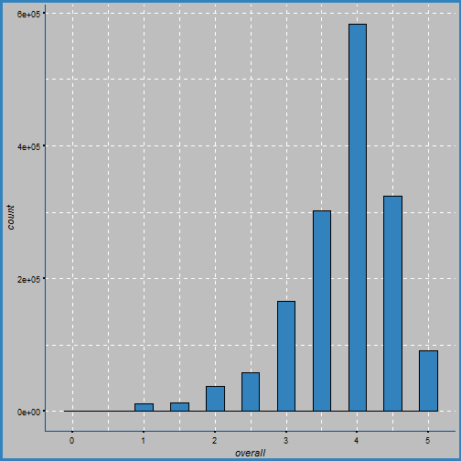
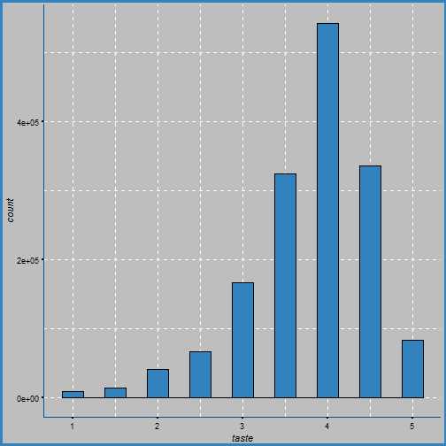
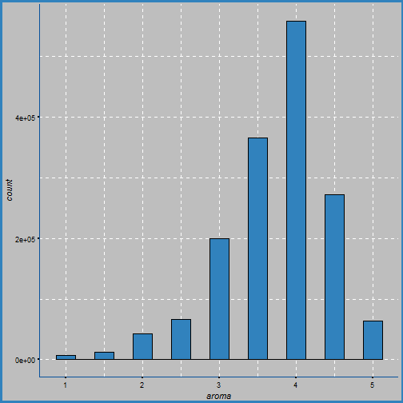
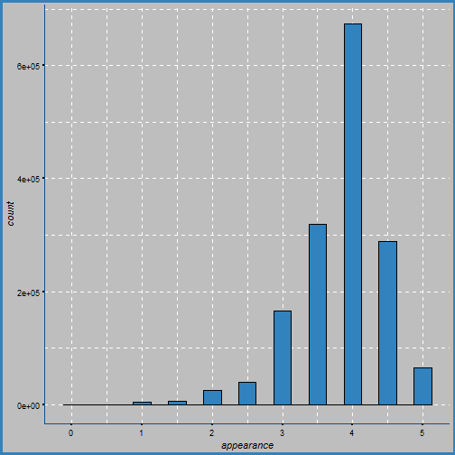
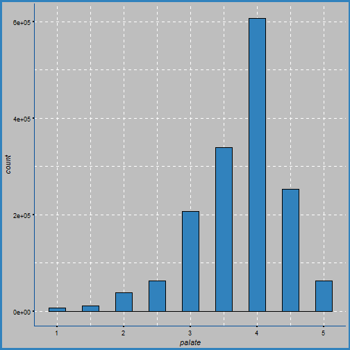
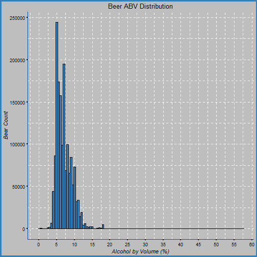

Beer Recommendation System 
========================================================
author: Sergey Mouzykin
date: December 21, 2017
autosize: true


 
Problem Statement
========================================================

- Contains about 1.5 million opinions on a large variety of beers
- Selection can be difficult having so many options
- Everyone has their own personal preference
- How do you recommened a beer? 
- How does one choose a beer? 

Approach
========================================================

Focus:

1. Find the overall rating for each beer style, beer name, and brewery.

2. How does each aspect, including alcohol content and beer style, affect the overall rating?

3. Recommend some number of beers based on preferred aspects (Ex.: Hefeweizen, taste, aroma). 

Data Set Overview
========================================================

- Contains about 1.5 million reviews
- Rated five aspects on scale 0-5
  - Overall, appearance, aroma, taste, palate

|Variable|Description|
|----|----|
|review overall| Overall rating of the beer 
|review aroma| Aroma rating
|review appearance| Appearance rating
|review profilename| Reviewer's profile name
|review palate| Palate rating
|review taste| Taste rating 
|brewery name| Name of the brewery
|beer style| Style of the beer
|beer name| Name of the beer
|beer ABV| Alcohol content of beer


Limitations
========================================================
Some information that we don't have

Country of Origin
- Not provided in this dataset
- This could be an important indicator as to why some beers have a low amount reviews 
- Some beers may only be available in certain countries and with limited supplies

Beer drinking population
- Some profile names have low amount of reviews 
    - May not be beer drinkers
- This may skew the results 
    - More likely to disagree on the ratings with someone who is a beer drinker
    
Ratings Distribution
========================================================

Overview

- Five aspects: Overall, taste, aroma, appearance, palate
- Each rated from 0 (bad) to 5 (great)

  
Ratings Distribution: Overall
========================================================
  

Ratings Distribution: Taste
========================================================



Ratings Distribution: Aroma
========================================================



Ratings Distribution: Appearance
========================================================



Ratings Distribution: Palate
========================================================


Alcohol Content (ABV)
========================================================

- Most beers ABV fall between 5 and 10%
  - Mean 7.04%
- Ranges from 0.01 to 57.7%
  - Very few beers with very high ABV

Plot: Alcohol Content (ABV)
========================================================



Results
========================================================
As stated earlier, the focus will be upon:

1. Find the overall rating for each beer style, beer name, and brewery.

2. How does each aspect, including alcohol content and beer style, affect the overall rating?

3. Recommend some number of beers based on preferred aspects (Ex.: Hefeweizen, taste, aroma). 

Results: Beer Style
========================================================
Find the overall rating for each beer style

Top 5

|Most Reviews (greatest to least) | Review Count |
|-------------|-------------|-------------| 
|American IPA | 117,586 |
|American Double / Imperial IPA | 85,977 |
|American Pale Ale (APA)| 63,469 | 
|Russian Imperial Stout | 54,129 | 
|American Double / Imperial Stout| 50,705 |

| Highest Rated | Rating |
|-------------|-------------| 
| American Wild Ale | 4.093 |
| Gueuze | 4.086 |
| Quadrupel | 4.071 |
| Lambic - Unblended | 4.049 |
| American Double / Imperial Stout | 4.030 |

Note: Numerically these are top 5, although many more would qualify as being rated very high

Results: Beer Name
========================================================
Find the overall rating for each beer name
Top 5

|Most Reviews (greatest to least) | Reviews |
|-------------|-------------|
| 90 Minute IPA | 3290 |
|Old Rasputin Russian Imperial Stout | 3111 |
|Sierra Nevada Celebration Ale | 3000 |
|Two Hearted Ale| 2728 |
|Arrogant Bastard Ale| 2704 |

| Highest Rated | Beer Style |
|-------------|--------------|
| American IPA | American Wild Ale |
| Dirty Horse | Lambic - Unblended |
| Southampton Berliner Weisse | Berliner Weissbier |
| Belgian-Style Barleywine | American Barleywine |
| Armand'4 Oude Geuze Lente (Spring) | Gueuze | 

Note: Numerically these are top 5, although many more would qualify as being rated very high

Results: Brewery Name
========================================================
Find the overall rating for each brewery
Top 5

|Most Reviews (greatest to least) | Reviews |
|-------------|-------------|
| Boston Beer Company (samuel adams) | 39,444 |
|Dogfish Head Brewery | 33,839 |
|Stone Brewing Co. | 33,066 |
|Sierra Nevada Brewing Co.| 28,751 |
|Bell's Brewery, Inc.| 25,191 |

| Highest Rated | Rating |
|-------------|--------------|
| Brauerei Zehendner gmbh | 4.61 |
| The Alchemist | 4.58 |
| Brouwerij Westvleteren | 4.54 |
| U Fleku Pivovaru a Restauraci | 4.52 |
| Peg's Cantina & Brewpub / Cycle Brewing | 4.51 | 

Note: Numerically these are top 5, although many more would qualify as being rated very high

Results
========================================================
How does each aspect, including alcohol content and beer style, affect the overall rating?


Results: Alcohol Content and Overall Rating
========================================================
How does alcohol content affect the overall rating?


- There is no clear correlation between beer's ABV and its impact on any rating
- Distribution of ABV factors are relatively well spread out across the ratings for each observation 

Results: Beer Style and Five Aspects
========================================================
Does the beer style affect any observation rating? 


- Again, distribution of the beer styles are relatively well spread out across the ratings
- No clear correlation between beer style and the ratings


Results: Five Aspects
========================================================
Do any of the aspects affect the overall rating? 

- Overall rating is affected in a linear manner by taste, aroma, appearance, and palate. 
- Strongest correlation was found between Taste and Overall
  - Better taste results in better overall rating
- Strong correlation was also found between Palate and Overall

Beer Recommendations
========================================================

Make a recommendation based on a single or multiple preferences

Preferences:
- 5 Aspects: Taste, Appearance, Aroma, Overall, Palate
- Beer Style (104) or General Beer Style (24)
- Alcohol Content Levels (Low, Below Normal, Normal, Above Normal, High)
  - OR numeric (Ex. ABV >= 5 %)


```
# A tibble: 5 x 15
                    beer_name review_count overall_mean taste_mean
                        <chr>        <int>        <dbl>      <dbl>
1 great lakes dortmunder gold          107     4.621495   4.556075
2    samuel adams octoberfest           18     4.500000   4.583333
3      great lakes eliot ness          107     4.528037   4.574766
4                dogtoberfest           12     4.416667   4.500000
5                  the kaiser           54     4.166667   4.518519
# ... with 11 more variables: aroma_mean <dbl>, appearance_mean <dbl>,
#   palate_mean <dbl>, rev_cnt_ovr <dbl>, mean_consistency <dbl>,
#   overall_sd <dbl>, taste_sd <dbl>, aroma_sd <dbl>, appearance_sd <dbl>,
#   palate_sd <dbl>, sd_consistency <dbl>
```


