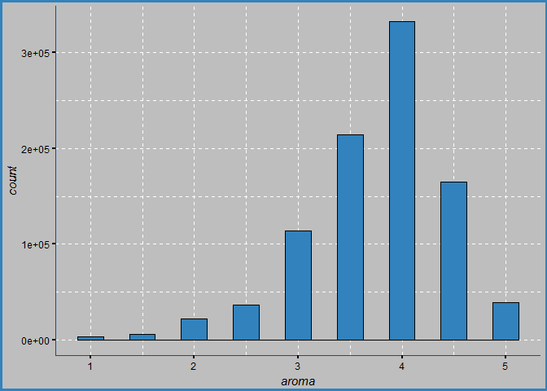

Beer Review: The Story of Data
================
Sergey Mouzykin
November 15, 2017

Your Capstone project milestone report is an early draft of your final Capstone report. We encourage you and your mentor to plan multiple milestones if possible, since your story will evolve with exploration and analysis. This is a slightly longer (3-5 page) draft that should have the following:

An introduction to the problem (based on your earlier Capstone submissions).

A deeper dive into the dataset:

-   What important fields and information does the data set have?
-   What are its limitations i.e. what are some questions that you cannot answer with this data set?
-   What kind of cleaning and wrangling did you need to do?
-   Any preliminary exploration you’ve performed and your initial findings.
-   Based on these findings, what approach are you going to take? How has your approach changed from what you initially proposed, if applicable?

Basically, the milestone is an opportunity for you to practice your data story skills. We encourage you and your mentor to plan multiple milestones if possible.

### Introduction

The great beer shortage has driven people to madness. No. That is obviously not true. On the contrary, the abundance of beer variety has left us with little imagination as to what the next micro brew will be found on the shelves of your local beer distributor. Perhaps there is hope in narrowing down your next selection before the next meal by using some type of recommendation system based on previous reviews. The decision for your next beer experience doesn't have to be a tedious one. Technology has made humanity interconnected like never before; it is here to make our lives easier and more efficient if used accordingly. It helps us make decisions of any magnitude, whether you're searching for a house or a perfect brew, our interconnected world will aid us in making those decisions.

### Dataset Preview

This dataset gives us a glimpse at the people's preference for beer. Some may be extreme beer enthusiasts and others are perhaps trying something different to break into the world of beer. In either case, this is a collection of their, roughly 1.5 million, opinions of the beer's physical characteristics such as aroma, appearance, palate, taste, and the overall impression. In addition, included are the brewery name, alcohol content and beer style which may play an important role in selecting an ideal beer.

| Variable           | Description                           |
|--------------------|---------------------------------------|
| review time        | Number of times the beer was reviewed |
| review overall     | Overall rating of the beer            |
| review aroma       | Aroma rating                          |
| review appearance  | Appearance rating                     |
| review profilename | Reviewer's profile name               |
| review palate      | Palate rating                         |
| review taste       | Taste rating                          |
| brewery name       | Name of the brewery                   |
| brewery ID         | Brewery's identification number       |
| beer style         | Style of the beer                     |
| beer name          | Name of the beer                      |
| beer ABV           | Alcohol content of beer               |
| beer ID            | Identification number of beer         |

### Limitations under construction

country of origin is not defined in this dataset and would require research. how was it collected? beer drinking population

### Cleaning and Wrangling

Before the analysis could begin, this data needed to be cleaned and wrangled. The process involved replacing missing values, changing all characters to lower case, renaming some of the column names, and reducing the amount of beer styles. Missing values were found in three columns containing profile names, alcohol content, and brewery names. The ABV (alcohol content) column, had the most missing values and were replaced with the calculated mean. Missing values within the profile names and brewery names columns were replaced with the string 'unknown'. Some column names contained superfluous information and therefore were renamed to make them short but descriptive. There are 104 beer styles contained within this dataset and were reduced to 24 in order to produce cleaner plots.

### Data Exploration: The Five Aspects

    ##                    Overall Rating Summary
    ## standard deviation 0.7206219             
    ## variance           0.5192959             
    ## mean               3.815581              
    ## median             4                     
    ## max                5                     
    ## min                0

    ##                    Taste Rating Summary
    ## standard deviation 0.7319696           
    ## variance           0.5357795           
    ## mean               3.79286             
    ## median             4                   
    ## max                5                   
    ## min                1

    ##                    Aroma Rating Summary
    ## standard deviation 0.6976167           
    ## variance           0.4866691           
    ## mean               3.735636            
    ## median             4                   
    ## max                5                   
    ## min                1

    ##                    Appearance Rating Summary
    ## standard deviation 0.6160928                
    ## variance           0.3795703                
    ## mean               3.841642                 
    ## median             4                        
    ## max                5                        
    ## min                0

    ##                    Palate Rating Summary
    ## standard deviation 0.6822184            
    ## variance           0.4654219            
    ## mean               3.743701             
    ## median             4                    
    ## max                5                    
    ## min                1

These histograms summarize the distribution of the five aspects and how they were rated. For all five aspects, we can see that a rating of four was given out quite frequently. In support to the histogram, we can also calculate the mean, median, standard deviation, maximum rating, and minimum rating. Essentially, the deviation can tell us how divisive people are among the ratings. This is perfectly reasonable since we all have our own personal preferences which may stem from our diverse backgrounds and personal experiences. Generally, it appears that people will agree on a rating value to within about 3/4 of a point. However, the deviation will vary with the beer name.

    ## # A tibble: 7 x 9
    ## # Groups:   beer_name, overall, taste, aroma, appearance [7]
    ##                 beer_name overall taste aroma appearance palate
    ##                     <chr>   <dbl> <dbl> <dbl>      <dbl>  <dbl>
    ## 1       latter days stout       0   2.0     4          0    2.0
    ## 2                pub pils       0   2.0     2          0    3.0
    ## 3      red rock amber ale       0   3.5     3          0    2.5
    ## 4 red rock bavarian weiss       0   2.0     2          0    2.5
    ## 5  red rock dunkel weizen       0   2.0     2          0    2.5
    ## 6        red rock pilsner       0   1.5     2          0    3.0
    ## 7           utah pale ale       0   2.0     3          0    2.0
    ## # ... with 3 more variables: beer_name_count <int>, overall_mean <dbl>,
    ## #   overall_sd <dbl>

It is interesting to find that in some of the more extreme scenarios, the ratings between different aspects vary greatly. In particular, for the beer, *Latter Days Stout*, we can find that a rating of zero for the overall was given out while at the same time its aroma was rated a four. It seems contradictory to rate the overall as a zero while enjoying at least one aspect of the beer, in particular, its aroma.

    ## # A tibble: 21,271 x 8
    ## # Groups:   beer_name [21,076]
    ##                                                                     beer_name
    ##                                                                         <chr>
    ##  1                                                                  "\"100\""
    ##  2 achievement beyond life's experiences (a.b.l.e.) (pizza port solana beach)
    ##  3                                                      acorn old moor porter
    ##  4                                                        almighty barleywine
    ##  5                                                       alt german style ale
    ##  6                                   andechser dunkel naturtrüb jubiläumsbier
    ##  7                                                 arctic fox chocolate stout
    ##  8                                                  barrel aged wet hopsickle
    ##  9                                                 berliner kindl bock dunkel
    ## 10                                        black marlin porter with cocoa nibs
    ## 11                                             blue point wet hops experiment
    ## 12                                                                 bookbinder
    ## 13                                               brewer's alley trinity stout
    ## 14                                                    burning oak black lager
    ## 15                                                               casta oscura
    ## 16                                                                  chub step
    ## 17                                            dark apparition - figgie smalls
    ## 18                                              devassa negra (tropical dark)
    ## 19                                                        double simcoe smash
    ## 20                                      duclaw exile 4 (macchiato milk stout)
    ## # ... with 2.125e+04 more rows, and 7 more variables:
    ## #   general_beer_style <chr>, beer_name_count <int>, overall_sd <dbl>,
    ## #   taste_sd <dbl>, aroma_sd <dbl>, appearance_sd <dbl>, palate_sd <dbl>

    ##                    Overall SD
    ## standard deviation 0.2027035 
    ## variance           0.04108872
    ## mean               0.5913669 
    ## median             0.5700877 
    ## max                1.917029  
    ## min                0

    ##                    Taste SD  
    ## standard deviation 0.1913261 
    ## variance           0.03660569
    ## mean               0.5552649 
    ## median             0.5368359 
    ## max                1.834848  
    ## min                0

    ##                    Aroma SD  
    ## standard deviation 0.1630964 
    ## variance           0.02660042
    ## mean               0.5177786 
    ## median             0.5029975 
    ## max                1.870829  
    ## min                0

    ##                    Appearance SD
    ## standard deviation 0.1556161    
    ## variance           0.02421637   
    ## mean               0.4828778    
    ## median             0.4664237    
    ## max                1.695582     
    ## min                0

    ##                    Palate SD 
    ## standard deviation 0.1713364 
    ## variance           0.02935616
    ## mean               0.5415573 
    ## median             0.5270463 
    ## max                1.643168  
    ## min                0

Calculating the deviation for each beer's respective five observations we can have a glimpse at how people may agree or disagree among the five observations. The lower deviation value implies that there is more agreement than disagreement among the reviews, and a higher deviation value implies more disagreement. We can also plot the distribution of these standard deviations and realize that it is highly likely that there will be disagreement among most beers but that disagreement will be relatively small. Ultimately, the beers which have greatest disagreements tend to be the ones with the least amount of reviews. From this, we can infer that those beers, in particular, may be best suited for people with a more developed taste for beer rather than for someone who drinks a beer on a seldom occasion.

### Data Exploration: Beer Alcohol Content

 This plot shows us that the ABV is actually a right-skewed distribution due to some beers having a a very high alcohol by volume content. The minimum and maximum of ABV content are 0.01% and 57.7%, respectively. The mean lies at 7.04, the median at 6.6, and the standard deviation is 2.27. We can also infer that the distribution is right-skewed due to the median being lower than the mean. Although the values range from 0.01 to 57.7, in theory, about 95% of these values should lie within two standard deviations from the mean.

    ##                    Beer ABV
    ## standard deviation 2.272372
    ## variance           5.163673
    ## mean               7.042387
    ## median             6.6     
    ## max                57.7    
    ## min                0.01

| Stat               | Value |
|--------------------|-------|
| Standard Deviation | 2.27  |
| Variance           | 5.16  |
| Mean               | 7.04  |
| Median             | 6.6   |
| Max                | 57.7  |
| Min                | 0.01  |

### Old Approach

1.  Find the overall rating for each beer style and the most popular beer style.

<!-- -->

1.  Which breweries produce the highest rated beers?

How does each aspect, including alcohol content and beer style, affect the overall rating?

Do any of the aspects affect the overall rating?

-   It appears as though the overall rating is not affected by any other rating such as the taste, aroma, appearance, or palate. Each observation seem to be indepedant of each other.

Does the alcohol content affect any observation rating?

-   There is no clear correlation between beer's ABV and its impact on any rating. In fact, the histogram shows us that the distribution of the ABV factors are relatively well spread out across the ratings for each observation.

Does the beer style affect any observation rating?

-   Again, the histogram shows us that the distribution of the beer styles are relatively well spread out across the ratings for each observation. None of the beer styles tend to cluster around any particular rating value; therefore, we cannot say that there is any correlation between beer style and the ratings.
